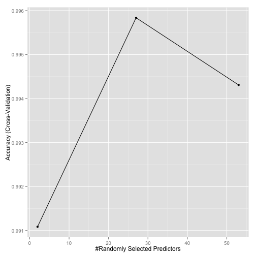

## 1. Introduction

Data collected from personal care devices can be used to quantify self movement so as to improve personal health. The goal of this study is to use the data from accelerometers on the belt, forearm, arm, and dumbell of 6 participants to evaluate how well they do it. In particular, the outcome variable is classe, which has 5 levels corresponding to correct and incorrect ways of barbell lifts.  

Data source: http://groupware.les.inf.puc-rio.br/har.  
  
Reference: Ugulino, Wallace, et al. "Wearable computing: accelerometers’ data classification of body postures and movements." Advances in Artificial Intelligence-SBIA 2012. Springer Berlin Heidelberg, 2012. 52-61.  

## 2. Data preprocessing  


```r
# load data
datax <- read.csv("pml-training.csv",na.strings = c("NA","","#DIV/0!"))

# remove the columns with high NA composition (>75% is NA) 
nr <- nrow(datax)
nc <- ncol(datax)
indna <- c()
for (i in 1:nc) {
    nacheck <- sum(is.na(datax[,i]))>0.75*nr
    if (nacheck==1) {
        indna <- c(indna,i)
    }
}
datax2 <- datax[,-indna]

# keep the data of complete cases
datax3 <- datax2[complete.cases(datax2),]
dim(datax2)
```

```
## [1] 19622    60
```

```r
dim(datax3)
```

```
## [1] 19622    60
```

```r
# remove meaningless columns for prediction
indrm <- grep("timestamp|X|user_name|new_window", names(datax3))
datax4 <-datax3[,-indrm]
dim(datax4)
```

```
## [1] 19622    54
```

```r
remove(datax2)
remove(datax3)
```

## 3. Model Fitting and Predictions  

#### Data preprocessing
Split the dataset "plm-training.csv" into a training set (60%) and and a testing set (40%).  

```r
# split the dataset "pml-training.csv" into a training set and a testing set
library(caret)
```

```
## Loading required package: lattice
## Loading required package: ggplot2
```

```r
library(ggplot2)

inTrain <- createDataPartition(y=datax4$classe, p=0.6, list=FALSE)
training <- datax4[inTrain,]
testing <- datax4[-inTrain,]
dim(training)
```

```
## [1] 11776    54
```

```r
dim(testing)
```

```
## [1] 7846   54
```

#### Model fitting  
The random forest algorithm was chosen to train the training dataset, because random forest gives high accuracy. Here the outcome is classe, and all the other variables are considered predictors.  

```r
set.seed(1299)
fitControl <- trainControl(method = "cv", number = 5, repeats = 3)
modfit <- train(classe~., data=training, method="rf",  trControl=fitControl, verbose=FALSE)
```

```
## Loading required package: randomForest
## randomForest 4.6-12
## Type rfNews() to see new features/changes/bug fixes.
```

```r
modfit
```

```
## Random Forest 
## 
## 11776 samples
##    53 predictor
##     5 classes: 'A', 'B', 'C', 'D', 'E' 
## 
## No pre-processing
## Resampling: Cross-Validated (5 fold) 
## Summary of sample sizes: 9420, 9420, 9421, 9422, 9421 
## Resampling results across tuning parameters:
## 
##   mtry  Accuracy   Kappa      Accuracy SD  Kappa SD   
##    2    0.9921871  0.9901166  0.003535123  0.004472005
##   27    0.9962636  0.9952737  0.001452034  0.001836650
##   53    0.9909988  0.9886136  0.001784941  0.002257571
## 
## Accuracy was used to select the optimal model using  the largest value.
## The final value used for the model was mtry = 27.
```

```r
ggplot(modfit)
```

 

```r
modfit$finalModel
```

```
## 
## Call:
##  randomForest(x = x, y = y, mtry = param$mtry, verbose = FALSE) 
##                Type of random forest: classification
##                      Number of trees: 500
## No. of variables tried at each split: 27
## 
##         OOB estimate of  error rate: 0.31%
## Confusion matrix:
##      A    B    C    D    E  class.error
## A 3346    2    0    0    0 0.0005973716
## B    9 2268    2    0    0 0.0048266784
## C    0    5 2048    1    0 0.0029211295
## D    0    0    9 1920    1 0.0051813472
## E    0    0    0    7 2158 0.0032332564
```

The result suggested that the final value for the model is mtry=27. This is because the accuracy is the highest when mtry=27. The corresponding accuracy is 0.9952446. The in sample error is 1-0.9952446=0.0047554.  

#### Cross validation  
In random forests, there is no need for cross-validation or a separate test set to get an unbiased estimate of the test set error, since cross-validation has been estimated internally.  

#### Out of sample error  
Use the model to predict the out of sample error on the testing dataset.  

```r
testingout <- predict(modfit, newdata=testing)
testingtbl<-table(testingout, testing$classe)
testing_accuracy <- sum(diag(testingtbl))/sum(testingtbl)
testing_err <- 1-testing_accuracy
testing_err
```

```
## [1] 0.003058884
```
That is, the out of sample error is 0.0030589.  

#### Use the prediction model to predict 20 different test cases.  

```r
# load the test dataset
testx<-read.csv("pml-testing.csv",na.strings = c("NA","","#DIV/0!"))

# remove the columns with high NA composition (>75% is NA) 
nrtest <- nrow(testx)
nctest <- ncol(testx)
indnatest <- c()
for (i in 1:nctest) {
    nacheck <- sum(is.na(testx[,i]))>0.75*nrtest
    if (nacheck==1) {
        indnatest <- c(indnatest,i)
    }
}
testx2 <- testx[,-indnatest]

# keep the complete cases
testx3 <- testx2[complete.cases(testx2),]
dim(testx2)
```

```
## [1] 20 60
```

```r
dim(testx3)
```

```
## [1] 20 60
```

```r
# remove meaningless columns for prediction
indrmtest <- grep("timestamp|X|user_name|new_window", names(testx3))
testx4 <-testx3[,-indrmtest]
dim(testx4)
```

```
## [1] 20 54
```

```r
# predict test dataset outcome
testxout <- predict(modfit, newdata=testx)
print(testxout)
```

```
##  [1] B A B A A E D B A A B C B A E E A B B B
## Levels: A B C D E
```
